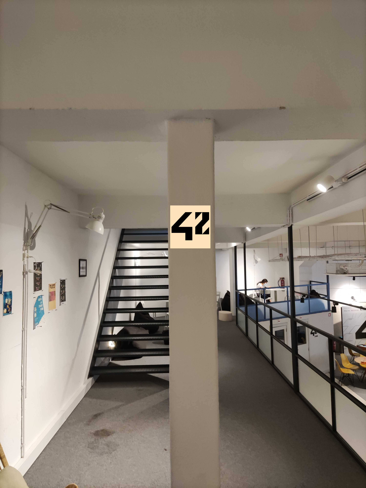
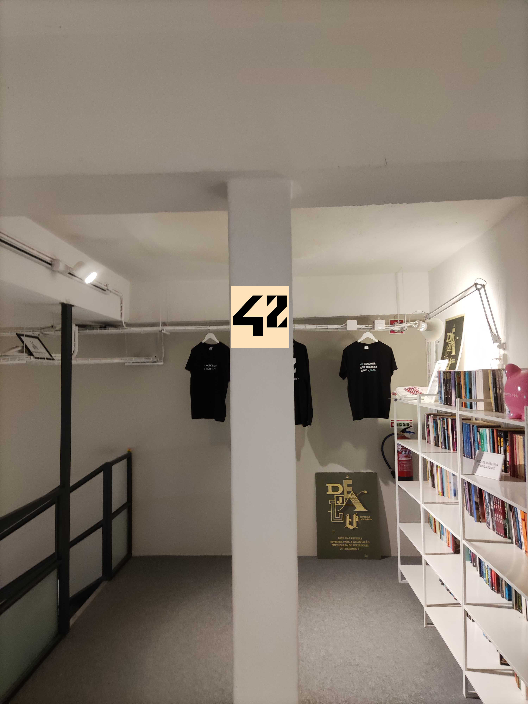
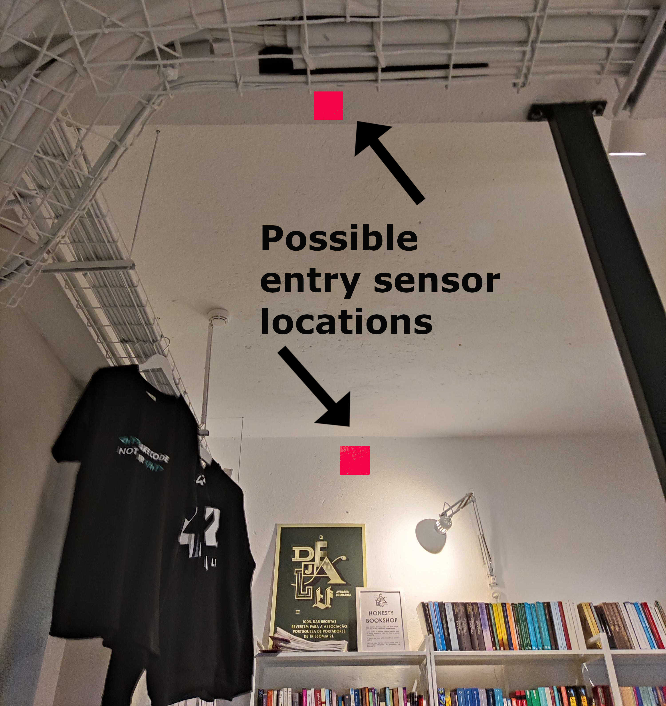
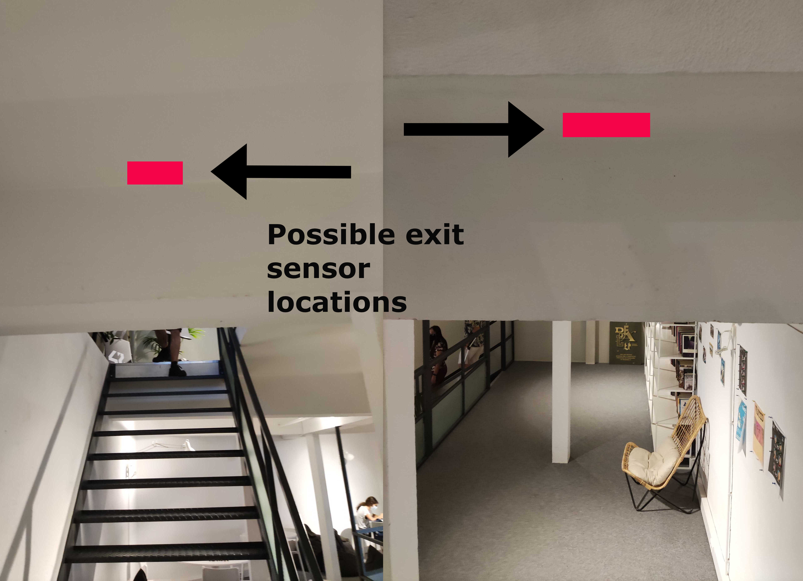

# 01_GREETING_MACHINE

## Making a nice GREETING_MACHINE for students entering or leaving the school!

## Images

Coming soon **™**

## Proof of concept

- Little screen with moving images or funny messages that activate when someone comes or leaves!
- Can start with just one screen
- Expandable!

## Roadmap

- Choosing screens and sensors -> Raspberry Pi OR Arduino
- Depending on mini computer -> wiring, power delivery
- FIRST PROJECT: Display the 42 Logo
- LATER: Expand to messages and images depending on the motion sensors
- EXTRA: Make it pretty ;)

## Inventory && Budget estimation

| Inventory | Budget Estimation |
|:---------:|:-----------------:|
|Raspberry Pi  OR  Arduino|Money €|
|LCD screen(s)  AND/OR LED strips|Money €|
|2 Motion sensors|Money €|
|Wiring|Money €|
|Power delivery/source|Money €|

### Research

>[LINK TO SPREADSHEET](https://docs.google.com/spreadsheets/d/18dQG1QeqEbwsyPYgIvcOHfFZCsI13GjzSqMwp9Vt0Kg/edit?usp=sharing)

### HANDY TUTORIALS Coming soon **™**
>[ARDUINO TUTORIAL WITH LED](https://arduinogetstarted.com/tutorials/arduino-motion-sensor-led)

>[CHEAP STORE? (free delivery from 50 euros)](https://www.electrofun.pt/)
Has a physical store in Gaia, Porto

>[STORE IN LISBON: MAUSER](https://mauser.pt/catalog/lojas.php#lisboa)